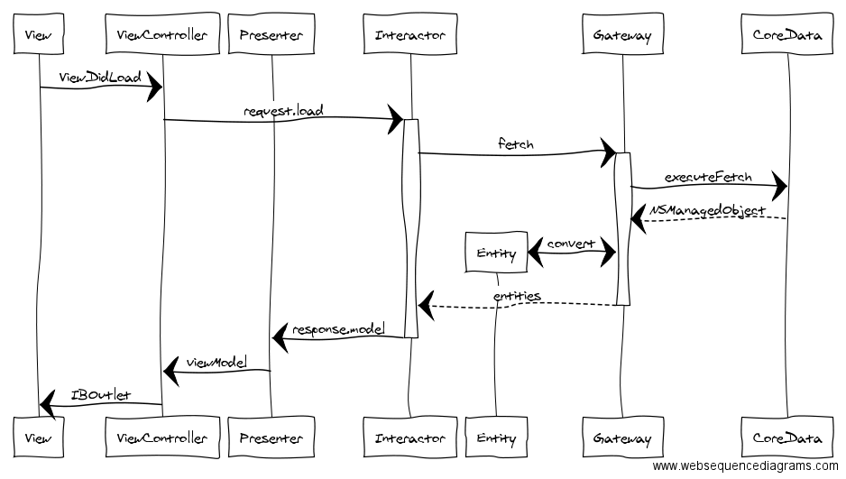

# CosyHome

CosyHome is an example iOS project for a home heating system developed using  [Clean Architecture](https://blog.8thlight.com/uncle-bob/2012/08/13/the-clean-architecture.html) and developed with [Acceptance Test Driven Development](https://en.wikipedia.org/wiki/Acceptance_test–driven_development) (ATDD).

This is considered to be a work in progress and feedback or proposals regards the architecture are welcome (post issues or PR's here on GitHub or contact me @paulstringer)

## Summary

The aim of this project is to illustrate an implementation of Clean Architecture in iOS. In doing so it also illustrates the benefits the flexibility this architecture provides. 

In this example because of a 'clean architecture' we've been able to implement an alternative approach to testing the apps external behaviour in a way that removes the need for [complex UI based testing approaches](http://stringerstheory.net/acceptance-testing-with-ios/). This results in more reliable and faster tests of your applications business logic.

Benefits of Clean Architecture also of course include

- Maintainability
- Enabling concurrent development
- Decoupling from the System, UI, etc.
- High reuseability of components
- Traceability, a place for everything, everything in it's place
- Extreme testability


*An example sequence flow of a typical iOS app implemented with Clean Architecture*

## Developed with ATTD

Initial analysis has been performed through the creation of a set of 'acceptance criteria' derived from user stories which have been implemented in the form of truth tables in [Fitnesse](http://fitnesse.org) (An integrated acceptance testing framework and Wiki). These tables provide a 'ubiquitous language' that can be understood by the whole team from Business Analyst to QA.

To simplify and automate acceptance testing of the application with Fitnesse the application is developed with 'clean architecture'. This clean architecture provides a decoupled set of interacting components which allows Fitnesse to be 'plugged in' to the business logic part of the application acting as a first and alternate UI. This allows testing to happen right from the start of development rather than right at the end.

This approach affords the ability to insert easily test data, explore all areas of business logic thorougly through accessing the APIs of the system. Finally we have the ability to verify the systems behaviour through responses sent directly back by the sytem under test, avoiding the slow and fragile approach of having to extract these through a UI based testing tool such as XCUITest.

Once development of the 'Interactor' and 'Presenter' layers of the architecture have been completed (driven by the acceptance tests) a UI is then added at the View Controller layer of our app. This final step becomes a simple wiring of view models to the view and the forwarding of IBActions to an Interactor (or use case). It is now trivial if we wanted to, to also add additional UI's for say tvOS, macOS or watchOS apps.

## Getting Started

To get started exploring the project, begin at the beginning with the Acceptance Tests and Fitnesse.

1. Open CosyHome.xcworkspace
2. Build the 'Acceptance Tests' target
3. In the terminal run ```./LaunchFitnesse``` from the workspace location
4. If needed install [Java](http://www.oracle.com/technetwork/java/javase/downloads/jre8-downloads-2133155.html) and download [Fitnesse](http://fitnesse.org/FitNesseDownload) (recent versions of Fitnesse require Java 1.8+)
5. Run the tests from Fitnesse and take a moment to understand the scenarios described
6. Open CosyHome.xcworkspace and compare the Fixture files in the 'AcceptanceTests' target and how these map to the scenarios described in Fitnesse
7. Compare how the ViewController and Fixtures are implemented and how they plug in to the same underlying system by implementing the same 'TemperatureGroupView' protocol.

## Try it Out

1. Create a simple Mac app that plugs into the same architecture with a Mac UI. The changes should be minimal and require nothing more than the addition of new ViewController and View classes specific for macOS.

## Credits

The clean architecture implemented is heavily based upon '[Viper](https://www.objc.io/issues/13-architecture/viper/)' and ['The Clean Architecture'](https://blog.8thlight.com/uncle-bob/2012/08/13/the-clean-architecture.html) by Uncle Bob.
